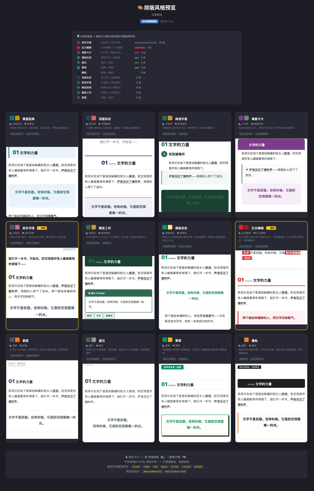

# Npie-Agent-Skills

> 🧑‍🎨 嗯哌AI (NpieAI) 的 Claude Code Skills 集合 — 把「聪明的大脑」变成「可复用的自动化工具」。

---

## ⚡ 核心 Skill：wechat-automator v2.0

**一站式微信公众号内容资产化引擎** — 说一句「发公众号」，从 Markdown 到草稿箱全部搞定。

```
你给一个文件 + 说一句「发公众号」
         ↓
  ⓪ 内容优化：脱水 + 结构重组 + 去 AI 味 → 🔴 你确认
  ① 排版渲染：预处理 → 类型判定 → 12 套预览对比 → 🔴 你选排版
  ② 一键发布：上传头图+封面 → 创建草稿
  ③ 收尾存盘：Articles/ 定稿归档
         ↓
  打开公众号后台 → 预览 → 群发 ✅
```

### 12 套精选排版主题

| 预设 | 布局 | 适用场景 |
|------|------|---------|
| `teal` 青蓝经典 | 经典左线 | 通用深度分析、工具盘点 |
| `navy` 深蓝杂志 | 杂志流 | 商业评论、行业分析 |
| `forest` 森语手册 | 手册流 | 教程指南、操作步骤 |
| `plum` 梅紫卡片 | 卡片流 | 产品介绍、工具清单 |
| `slate` 岩灰书信 | 书信流 | 个人随笔、读书感悟 |
| `amber` 暖金工坊 | 极客流 | 技术编程、AI 实战 |
| `moyu` 摸鱼杂志 | 摸鱼杂志 | 教程测评、工具盘点 |
| `ruby` 红白编辑 | 红白编辑 | 观点分析、读书感悟 |
| `graph` 素砚 | 素砚 | 设计评论、科技观点 |
| `zen` 虚白 | 虚白 | 深度随笔、读书笔记 |
| `ticket` 票根 | 票根 | 工具对比、创意测评 |
| `olive` 墨帖 | 墨帖 | 案例复盘、深度评测 |



### 核心特性

- **四阶段管线**：内容优化 → 排版渲染 → 一键发布 → 收尾存盘
- **智能主动标记**：章节自动编号、关键词下划线、英文标签、引言高亮、目录提取
- **三层视觉层级**：锚点层(≤5处) / 标记层(每段1-3处) / 容器层(≤3种)
- **通用组件库**：内容标签、流程卡片、时间线、封面卡、END 分割线、CTA 三连等 16 个组件
- **`<span leaf="">` 自动包裹**：防微信样式剥离
- **14 条铁律**：每条来自生产事故的血泪教训

更多细节见 [`skills/wechat-automator/README.md`](skills/wechat-automator/README.md)

---

## 其他 Skills

### reading-guide

基于《如何阅读一本书》四层次阅读法的 AI 阅读教练。在你翻开书之前建立认知框架，读完后带你走完分析阅读三阶段。

→ [`skills/reading-guide/README.md`](skills/reading-guide/README.md)

### html-slides-generator

零依赖、单文件的 HTML 网页幻灯片生成器。内置 37 套风格预设，把任何文本变成可分享的交互式网页 Slides。

→ [`skills/html-slides-generator/README.md`](skills/html-slides-generator/README.md)

---

## 仓库结构

```
Npie-Agent-Skills/
├── skills/
│   ├── llms.txt                      # Skill 索引
│   ├── wechat-automator/             # 公众号排版发布引擎 v2.0
│   │   ├── SKILL.md
│   │   ├── README.md
│   │   ├── scripts/
│   │   │   ├── build_inline.py       # 排版引擎（12 布局 × 8 配色）
│   │   │   ├── preview_themes.py     # 12 套预览对比生成器
│   │   │   └── upload.py             # 头图+封面+草稿箱上传
│   │   └── img/
│   │       ├── Layout_style.png      # 12 套效果预览
│   │       ├── cover.png
│   │       └── header_image.png
│   ├── reading-guide/                # 如何读书实践教练
│   │   ├── SKILL.md
│   │   ├── README.md
│   │   ├── references/
│   │   └── templates/
│   └── html-slides-generator/        # HTML 网页幻灯片生成器
│       ├── SKILL.md
│       ├── README.md
│       ├── STYLE_PRESETS.md
│       ├── bold-template-pack/
│       ├── references/
│       └── scripts/
└── README.md
```

---

## 使用方式

```bash
git clone https://github.com/BannyLon/Npie-Agent-Skills.git

# 安装 Skill（以 wechat-automator 为例）
cp -r skills/wechat-automator ~/.claude/skills/wechat-automator/

# 设置凭据（可选，用到时 Claude 会问你）
export WEIXIN_APPID="你的公众号 AppID"
export WEIXIN_APPSECRET="你的公众号 AppSecret"
```

---

## 适用场景

- 自建 LLM Agent / AI 助手平台
- Claude Code 自定义 Skills 集合
- 内容团队、运营团队、个人知识管理自动化

每个 Skill 是独立的可插拔模块，通过 `skills/llms.txt` 按需调度。

---

## 许可证

MIT
