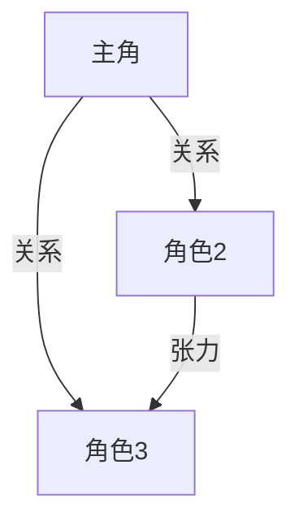

# 《书名》阅读指南（想像文学）

> 作者 | 类型：{小说/戏剧/史诗/抒情诗} | 评分 | 🎭 想像文学
> 按艾德勒的规则：不要找共识/主旨/论述。这是经验的传递，全身心投入体验。

---

## 📇 快照

| 维度 | 判断 |
|------|------|
| **类型** | {小说/戏剧/史诗/抒情诗}，{长篇/中篇/短篇} |
| **难度** | ⭐{1-5} {一句话} |
| **基调** | {温暖/冷峻/荒诞/史诗/私密/...} |
| **适合谁** | {一句话描述目标读者} |
| **精读价值** | {高/中/低}——{一句话理由} |

---

# 预读（检视阅读级）

## 情节大意

[一个完整句子说出整个故事在讲什么]

## 叙事结构

[从章节划分推断故事推进方式]

## 进入这个世界

[这本书创造的世界的基调、时代、氛围——基于简介和热门划线]

## 阅读策略

{小说：快读，全心全意，一口气读完。不要被人物名字吓退 | 戏剧：假想演出实景，想象自己是导演 | 史诗：集中注意力，全心参与，可以先读散文诠释本 | 抒情诗：一口气读完不停，然后大声重读}

## 阅读时带着这些问题

[3-5 个体验性问题。不要问"主旨是什么"，问"你会怎么描述主人公的处境""哪个场景让你最不安"等]

---

## 你的阅读状态

{进度 X% | 尚无数据}
{N 条划线，M 条笔记 | 建议在阅读时做标记——哪怕只画下让你心动的句子}

---

## 📋 预读行动清单

- [ ] **读前**：{进入这本书之前的一个准备动作}
- [ ] **读中**：{标记让你心动的句子 / 注意某个角色 / 留意某个主题}
- [ ] **读后**：{回来做读后分析 / 写一句话感受 / 跟人讨论}

---

# 读后（分析级）

## 情节复盘

- **开头**：
- **中段**：
- **结尾**：
- **高潮关键**：

## 角色地图

| 角色 | 核心特质 | 变化弧线 |
|------|---------|---------|
| ... | ... | ... |

## 🧠 角色关系图

## 世界的法则

[这个虚构世界运行的规则是什么？什么在这里是"真实的"？]

## 关键场景

[哪几个场景/对话让你印象最深？为什么？用一两句话描述每个]

## 体验反思

- 这个故事在你身上产生了什么作用？
- 它触动了你哪个部分？（不是"讲了什么道理"，是"唤起了什么"）
- 你进入并体验了这个世界，还是始终站在外面分析它？

## 📋 读后行动清单

- [ ] **立即**：{读完后的第一个行动——写下来/说出来/做点什么}
- [ ] **本周**：{这本书可以带进生活的一件事}
- [ ] **以后**：{重读的时机 / 什么时候再翻开它}

---

## 📚 延伸阅读

| 书名 | 关联理由 |
|------|---------|
| ... | 同类型/同主题/同作者 |
| ... | 如果你喜欢这本书，你也会喜欢... |
| ... | 想换一个口味？试试... |

---

> 💡 想像文学的核心不是「对不对」，而是「美不美」「真不真（在它的世界里）」。不要用分析非虚构的刀来切这块蛋糕。
