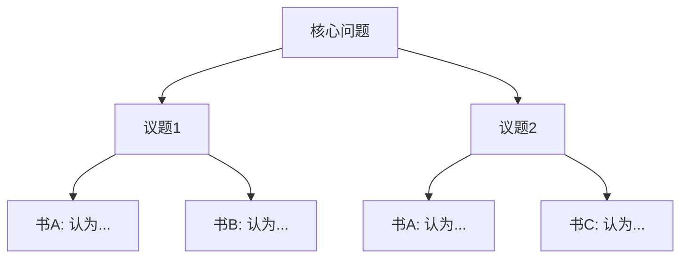

# 主题阅读：《主题名称》

> 📚 主题阅读（Syntopical Reading）— 第四层次，就一个主题读多本书，建构新分析。

---

## 📇 快照

| 维度 | 判断 |
|------|------|
| **主题** | {一句话定义这个主题} |
| **涉及书目** | {N} 本 |
| **核心争议** | {这个主题下最核心的分歧是什么} |
| **你的问题** | {你为什么要研究这个主题？你想搞清楚什么？} |

---

## 书单概览

| # | 书名 | 作者 | 分类 | 与主题相关性 |
|---|------|------|------|------------|
| 1 | ... | ... | ... | ⭐⭐⭐ |
| 2 | ... | ... | ... | ⭐⭐ |

---

## 分书检视摘要

### 《书 A》
- **一句话**：
- **核心问题**：
- **相关章节**：

### 《书 B》
...

---

## 中立术语体系

> 用你的语言统一不同作者的术语——这是主题阅读最难的一步。

| 你的术语 | 书 A 用语 | 书 B 用语 | 书 C 用语 |
|---------|---------|---------|---------|
| ... | ... | ... | ... |

---

## 中立问题清单

[建立一组所有作者都能回答的问题]

1. ...
2. ...
3. ...

---

## 🧠 议题地图

---

## 议题矩阵

| 议题 | 书 A | 书 B | 书 C | 争议焦点 |
|------|------|------|------|---------|
| ... | ... | ... | 未涉及 | ... |

---

## 分析讨论

> 不是问「谁对谁错」，而是问「这些争论揭示了什么？」

### 共识区
[多数作者共同的观点]

### 争议区
[分歧在哪里？为什么会有分歧？是术语不同还是立场不同？]

### 盲区
[哪些问题没有作者涉及？为什么大家都避开了？]

### 你的分析
[基于以上，你建构出的新理解是什么？这些书加在一起告诉了你什么单独一本没告诉你的？]

---

## 📋 行动清单

- [ ] **立即**：{主题阅读完成后的第一个行动}
- [ ] **深入**：{哪本书值得做完整分析阅读？}
- [ ] **输出**：{把这个主题阅读的发现写成什么——文章/视频/讨论/决策}

---

## 📚 下一步阅读

| 书名 | 理由 |
|------|------|
| ... | 补上盲区的书 |
| ... | 挑战当前共识的书 |
| ... | 更深/更专的下一步 |
